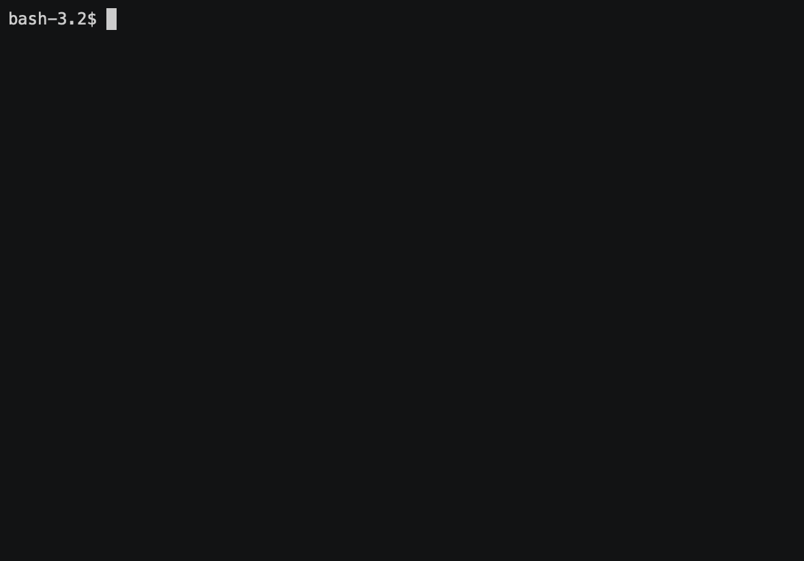

# BrainGames

<a href="https://codeclimate.com/github/AleksandrSerov/frontend-project-lvl1/maintainability"></a>
[](https://travis-ci.org/AleksandrSerov/brainGames)

## Description

Set of mini-games launched from the console

Game example:

```bash
$ brain-progression

Welcome to the Brain Game!
What number is missing in this progression?

May I have your name? Roman
Hello, Roman!

Question: 14 .. 18 20 22 24 26 28
Your answer: 16
Correct!
Question: 5 6 7 8 9 .. 11 12
Your answer: 10
Correct!
Question: 12 15 18 21 .. 27 30 33
Your answer: 24
Correct!
Congratulations, Roman!
```

## Installation

```bash
git clone https://github.com/AleksandrSerov/frontend-project-lvl1.git
cd brainGames
make install
```

## Publish package

```bash
make publish
```

## Installation package

```bash
sudo npm link
```

## Scripts

- `make games` - Start brain-games.js
- `make even` - Start brain-even.js
- `make calc` - Start brain-calc.js
- `make gcd` - Start brain-gcd.js
- `make prog` - Start brain-progression.js
- `make prime` - Start brain-prime.js
- `make publish` - Publish project
- `make lint` - Start lint
- `make install` - Install dependences

## Demo

### Even


### Calc



### Gcd


### Progression


### Prime


